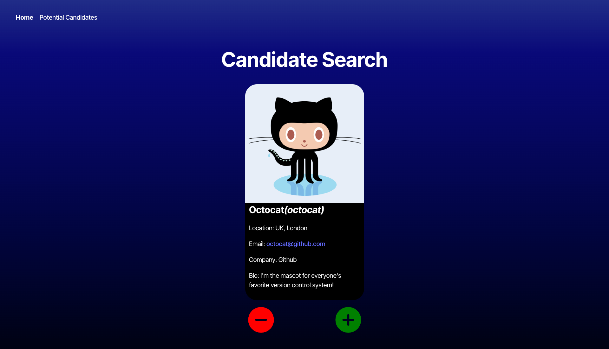

# Candidate Finder

A React + TypeScript application that helps employers discover and track potential candidates using data from the GitHub API. Users can review randomly selected GitHub profiles, save promising ones, and view a list of saved candidates.

## 📸 Screenshot



## 🚀 Live Demo

🔗 [Deployed App on Render](https://your-render-url.com)

## 🧠 Features

- View one random GitHub candidate at a time
- Accept or reject candidates
- View saved candidates on a separate page
- All data stored in browser `localStorage`
- Fully responsive and clean UI
- Built with TypeScript + React Router

## 🔧 Technologies

- React
- TypeScript
- React Router DOM
- GitHub REST API
- Vite
- Local Storage

## 📦 Installation

1. Clone the repository:
   ```bash
   git clone https://github.com/your-username/candidate-finder.git
   cd candidate-finder

## 🙌 Acknowledgments
- GitHub REST API — for providing access to public user profile data.
- University of Utah Coding Bootcamp — for the project concept and starter files.
- ChatGPT — for guidance, debugging help, and helping shape clean, readable code and documentation throughout the project.